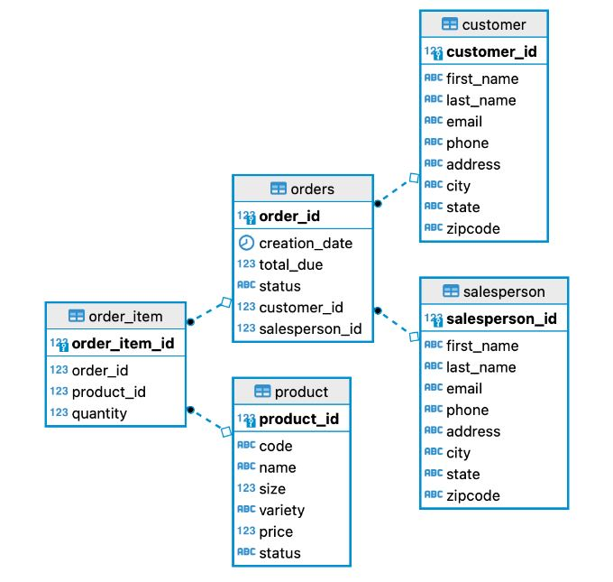

# Introduction

Technology used:
* Java 8
* JDBC
* PostgreSQL
* Maven
* Docker
* DBeaver

# Implementaiton
## ER Diagram

## Design Patterns
The Data Access Object (DAO) pattern is a structural pattern that allows us to isolate the application/business layer from the persistence layer using an abstract API. DAOs act as an intermediary between the application and the database. The rest of the application is hidden from any storage-related information. As a result, it is possible to implement potential modifications to the persistence mechanism by just changing one DAO implementation without having an impact on the rest of the application.

The repository design pattern is an abstraction of the data layer. It isolates domain models (or entities) from the implementation details of the data sources. If your app has a complicated data layer with numerous APIs returning unstructured data (like JSON), which you wish to separate from the rest of the app, the repository design pattern is quite helpful.

# Test
The SQL scripts were used to generate the tables and insert mock data. By setting up a Docker container that is running the Postgres database, the application was tested.CRUD and join operations were tested by creating, updating, and deleting data and then the results were compared on the database.
