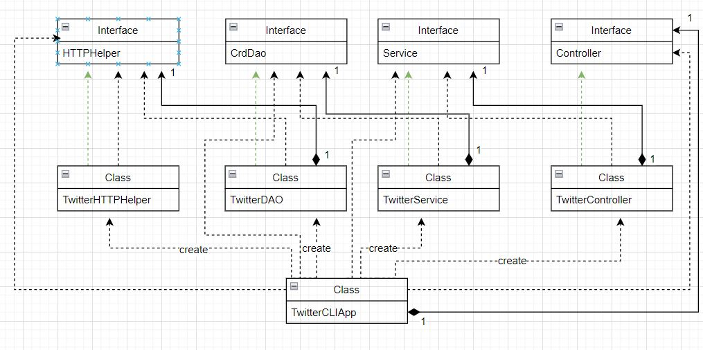
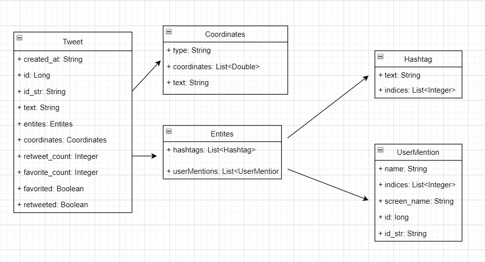

# Introduction
The Twitter CRD application provides a method for a CLI to CRD (Create, Read, and Delete) tweets through Twitter's REST APIs. Maven and Springboot were used to organize this Java-based application. Unit and integration testing were done using JUnit and Mockito. The application was then deployed using Docker.

# Quick Start

# Design
## UML diagram

## Models

## Spring

# Test

# Deployment

# Improvements
