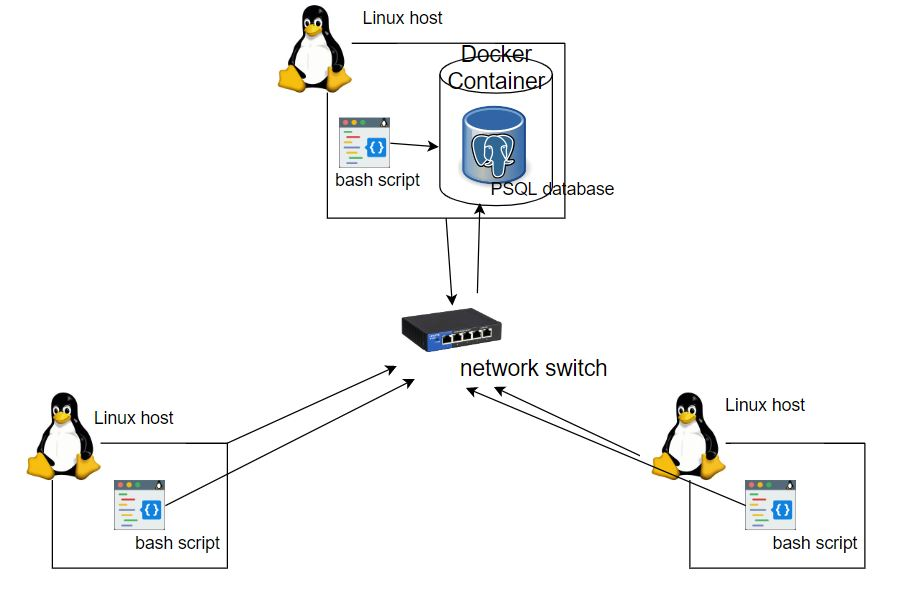

<<<<<<< HEAD
# Linux Cluster Monitoring Agent

## Introduction
The Linux Cluster Monitoring Agent is a minimum viable product (MVP) that provides metrics that can be used to get information about system activities. 
It can be used by the LCA team to meet their business needs (e.g. collect hardware specification data, resource usage data, find the possible causes of a performance problem, etc.)
This project includes 3 bash scripts. One of those is used to create, stop, and start the PSQL Docker instance. The other two are used to gather data. Collected data will automatically insert into a RDBSM database.
Additionally, this project has 2 sql scripts that let the LCA team do various administrative queries to more effectively track cluster consumption. 
These queries give the user the ability to categorize hosts based on hardware information, the average memory usage over a 5-minute period for each host, and check for host failures using the crontab process.

The technologies used:

* bash scripts (used to gather the hardware specification data, resource usage data, and manage docker)
* Postgres v9.6 database (stores the collected data)
* psql v9.2.24 (PostgreSQL client application used to administer the Postgres database)
* Crontab (monitors resource usage every minute and check failures)
* git v1.8.3.1 (version control software)
* Docker v20.10.17 (container running the Postgres database)
* IntelliJ IDEA (used as the IDE to edit files)
* Jarvis Remote Desktop (JRD) (development and testing environment running CentOS 7)
* Google Cloud Platform (GCP) (provided the instance to run the JRD)


## Quick Start
* Start a psql instance using `psql_docker.sh`
```bash
# create a psql docker container with the given username and password.
./scripts/psql_docker.sh start|stop|create [db_username][db_password]
```

* Create tables using `ddl.sql`
```bash
# Execute ddl.sql script on the host_agent database againse the psql instance
psql -h localhost -U postgres -d host_agent -f sql/ddl.sql
```

* Insert hardware specs data into the DB using `host_info.sh`
```bash
./scripts/host_info.sh psql_host psql_port db_name psql_user psql_password
```

* Insert hardware usage data into the DB using `host_usage.sh`
```bash
./scripts/host_usage.sh psql_host psql_port db_name psql_user psql_password
```

* Crontab setup
```bash
bash> crontab -e
#add this to crontab
* * * * * bash /absolute_path_of_script/host_usage.sh localhost 5432 host_agent postgres password > /tmp/host_usage.log
```


## Implemenation
The project was implemented using Linux command lines, Bash scripts, PostgreSQL, docker, IntelliJ IDEA, crontab, RDBSM database, and SQL queries

### Architecture


### Scripts
- ```psql_docker.sh```  -- create, start, or stop a PSQL container
```bash
# create a psql docker container running the Postgres database if it already doesn't exist with a given username and password. It is also used to start and stop the docker container.
./scripts/psql_docker.sh create db_username db_password
./scripts/psql_docker.sh start
./scripts/psql_docker.sh stop
```

- ```host_info.sh``` -- collects hardware specification data (assumed to be static, including the hostname, CPU information, and memory information); this script will be executed only once at installation time and this script should run before the host_usage.sh script to ensure the database is set up correctly.
```bash
# This command will insert the hardware specifications data into the Postgres database
./scripts/host_info.sh psql_host psql_port db_name psql_user psql_password
```
where psql_host is the Postgres host running the database, psq_port is the port the Postgres server that is listening on, db_name is the database name (host_agent is the default), psql_user is the Postgres username used when creating the database, and psql_password is the Postgres password used when creating the database.

- ```host_usage.sh``` -- collects server usage data (runs every minute, including memory information, CPU information, and disk usage)
```bash
./scripts/host_usage.sh psql_host psql_port db_name psql_user psql_password
```
where psql_host is the Postgres host running the database, psql_port is the port the Postgres server is that listening on, db_name is the database name (host_agent is the default), psql_user is the Postgres username used when creating the database, and psql_password is the Postgres password used when creating the database.

- crontab  -- execute ```host_usage.sh``` every minute
```bash
# edit crontab file
crontab -e
# add command to crontab file
* * * * * bash /absolute_path_of_script/host_usage.sh psql_host psql_port db_name psql_user psql_password > /tmp/host_usage.log
```
where psql_host is the Postgres host running the database(localhost is the default), psql_port is the port the Postgres server is that listening on (5432 is the default), db_name is the database name (host_agent is the default), psql_user is the Postgres username used when creating the database(postgres is the default), and psql_password is the Postgres password used when creating the database(password is the default).

- ```queries.sql``` is used to solve some business objectives:
  - Group hosts together by CPU number and sort them by memory size
  - Average used memory over 5 minute intervals and displayed as a percentage for each host
  - Detect host failures by checking if the cron job inserts at least 3 data points within a 5-minute interval


### Database Modeling
In this project, there are two tables to persist hardware specifications data and resource usage data into the psql instance to perform data analytics.
* `host_info`

Fields | Type | Constraint | Description
-------|------|------------|-------------
id     | SERIAL | PRIMARY KEY | This unique identifier is automatically generate when inserted into the database.
hostname       | VARCHAR | NOT NULL | Name of the Linux server
cpu_number     | INT | NOT NULL | Number of CPUs in the server
cpu_architecture | VARCHAR | NOT NULL | Architecture of the CPU in the server
cpu_model        | VARCHAR | NOT NULL | Model of the CPU in the server
cpu_mhz          | FLOAT(3) | NOT NULL | Processor speed of the CPU in the server
L2_cache         | INT | NOT NULL | Size of the L2 cache in the CPU in the server
total_mem        | INT | NOT NULL | Total memory installed in the server
timestamp        | TIMESTAMP | NOT NULL | Time of host_info script execution

* `host_usage`

Fields | Type | Constraint | Description
-------|------|------------|-------------
timestamp    |  TIMESTAMP | NOT NULL | Time of host_usage script execution
host_id      |  SERIAL | FOREIGN KEY, REFERENCES host_info (id) | ID of the host in host_info table 
memory_free  |  INT | NOT NULL | Amount of the free memory 
cpu_idle     |  INT | NOT NULL | Percentage of the CPU that is not being used
cpu_kernel   |  INT | NOT NULL | Percentage of CPU is used by the kernel
disk_io      |  INT | NOT NULL | Number of disk I/O
disk_available | INT | NOT NULL | Available disk space in the root directory 

## Test
All scripts were developed and tested on the Jarvis Remote Desktop instance which runs on a Google Cloud platform instance(Centos 7). Bash scripts were tested manually by executing with correct, incorrect, and insufficient CLI arguments. SQL queries were tested by manually inserting mock data inputs, filtering the outcomes, and comparing them to what was anticipated (since we only have one single machine, not a Linux cluster). All scripts functioned as expected.

## Deployment
All scripts were deployed to GitHub repositories using the Jarvis Remote Desktop.
Crontab was used to routinely automate server usage data entries.
Docker is used to provision the database, and sql queries are executed through postgres.

## Improvements
* Show the Memory or CPU as WARNING/CRITICAL state when there is not enough memory or CPU
* Handle hardware update; the current host_info script assumes the hardware specifications are static
* Add more SQL queries to collect other useful information (e.g. Network Monitorin)
=======

>>>>>>> master
